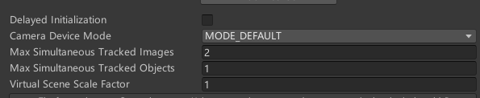
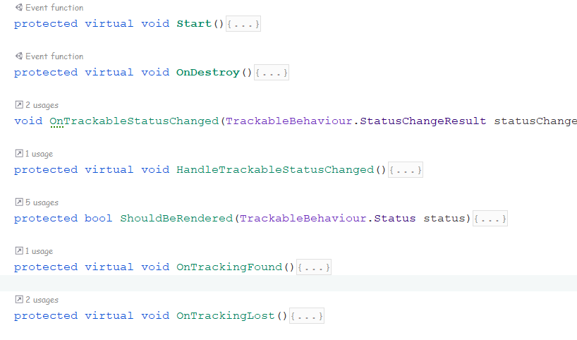

# VuforiaL
本项目是个人学习Vuforia时，做的笔记，经编辑后形成的笔记式教学。主要针对有Unity基础，希望使用VuforiaSDK开发AR应用但从未接触过的同学的入门教程

内容涉及基础识别、识别原理和开发细节，最后将提供一个基础识别例子

构建项目，应先使用应先导入VuforiaSDK，接着在Unity打开项目，完成SDK基础配置，按照教程开始学习。
项目环境：Untiy2021、Vuforia9.7.4

**所有使用的Prefab来自UnitySotre，欢迎读者提供意见建议**

# 导入Vuforia与Prefab

国内下VuforiaSDK贼拉屎，官网提供3个方法
1.  懂git的人就用Git的那个
2.  不懂的，我推荐下zip，手动安装，链接（会自动更新这里就不放了）在官网有写，下最新的那个下好后，在你的unity项目的Package里解压，你下的东西解压出来也叫package，文件结构长这样，完事打开unity他会自动导入


3.  剩下那个浪费生命的，别用，扑街来的

接着导入项目将用到的Prefab，将`Assets\UnityAssest\应放置于此处的包.md`内容导入到`Assets\UnityAssest\`下（均来自UnityAssetsStore）

# 配置及首次识别

-   首先得有一张识别图，先别问那么多问题，跟着做
-   偷你爸妈一张扑克，建议选J、Q、K的中的一张梅花最好
-   然后网上找图，找跟你选的一样花色数字的扑克的原图，网图和你偷的那张长的要一样（建议稍微裁剪一下网图，让实物和网图比例一样）。
-   在Vuforia官网开发者那块，自己注册一个license，然后转到TargetManage，Add一个database，然后点进database，addtarget把网图放上去，等到搞好回到database界面可以看到刚刚add的图，下载database，把下载好的压缩包导入unity
    
    
-   在新场景中插入ARcamera,在“检查栏“找到Vuforia的脚本，打开Open。。。
    
-   输入自己的applicenseKey（官网注册那个）

## 对ARCamera解释
**具体使用例子后面会再给出**，下面稍微解释一下几个框什么意思（不看也行，以后用到回头看看就好）


1.  不知道
2.  识别时的性能，质量/速度优先，一般选Default（均衡）就行
3.  一次最多识别几张图
4.  一次最多识别几个物件
5.  要识别的物体，在unity的缩放比例，方便你不用调prefab的比例去适应识别图的大小，调整识别图大小适应prefab大小，因为一般prefab比识别图多，调这么多prefab很麻烦。如图，而且如果这些3Dobject太小，以后做微调很麻烦，滚轮滚一下就滚飞了。
    
## 对识别图解释
    现在，在sence下面创建一个Vuforia的ImageTarget。
    
    接着能在检查区看到一下内容（好几年都长这样）
    
6.  Transform，位置信息
7.  ImageTargetBehaviour，这个ImageTarget的识别图图案长啥样这里定义，database名是你自己刚刚取的，选刚刚加进去的那张图就好了。
    
8.  DefaultTrackableEventHandler，场景启动后会自动调用的代码，后面教怎么用
9.  TurnOffBehaviour，场景关掉的时候被调用，后面再教
10. 剩下的是untiy本身都会有的一些东西，跟Vuforia关系不大，想学的区上untiy的课，这里我看看吧有空就讲。

看完脚本，先在imagetarget下创建一个3d物件（右键，选跟我一样的就行）

双击，ImageTaget的DefaultTrackableEventHandler脚本，进入C#编辑
不要修改这份代码，如果复制这份到别的文件夹（建议自己新开的），改一下复制过来的代码文件名，把这份改了名的拖到ImageTarget里面，删除原来那份（DefaultTrackableEventHandler），完事双击改名后的代码进入编辑


**脚本介绍：** 9.6版有这么多函数，最重要的是开头2个和最后2个，中间的都是在响应识别，识别到了它们就调用OnTrackingFound丢失就调用OnTrackingLost， start和onDestroy自然是整个程序开场和结束自动调用的。

OnTrackingFound、OnTrackingLost只能在第一个if里面写代码，所有你写的东西在被探测到或丢失识别时都是在这个if里面执行的。

再大致说一下中间3个
1\.	OnTrackableStatusChanged，获得当前状态，就是感受现在是不是识别到了，然后记录在全局变量里，完了就调用下面那个HandleTrackableStatusChanged
2\.	HandleTrackableStatusChanged，根据你的要求选则是否调用最后的2个函数。这外面可以选识别模式的，这里选的是识别到或识别过都执行OnTrackingFound（）

3\.	最后一个辅助上面HandleTrackableStatusChanged做if判断的，让代码更好看而已。

好了，现在按Untiy的播放，把扑克放在摄像头前就能看到刚刚添加的子物体了。

# 重要Vuforia实现细节
上面那些都不算啥，记得ArCamera的这个脚本吗?
看清楚worldCenter，我这里选特定物体作为世界中心，这就以为着，它的位置代表着基座标（0，0，0），它的x、y、z方向是基准方向。其他物体以它为参照，arcamera也一样。

又因为arcamera是把你定义的所有物体、活动什么的放置它和真实场景之间，所以摄像机轻微的抖动，世界中心虽然没变，但其它物件的xyz都变化了，因此没有办法用通常的方法定义xyz什么的，但也提供了方便操纵一组物件时方便确定它们各自位置关系，所以在写代码的时候要注意对这方面的变化做缓冲，还有不用角度时怎么定义它们关系。

项目内，通过同时识别igStart和igRb，查看helpper检查项进行学习


经过我的测试，平放的2张识别图，以其中一张为世界中心，它们的差值分别是倒数4、5行，容忍范围是0.2时，只有在较水平的角度拍摄时才能看做未发生抖动。

# 简单交互
## 双击删除（注释掉的部分）和长按删除
在unity内建一个c#，代码如下，挂到arcamera上就行了（要发布到手机才能用），原理是相机发射射线戳到gameobject的碰撞体产生交互，因此要给物件加碰撞体(collider)

Touche.cs
```CS
public class TouchActivate : MonoBehaviour
{
    //长按
    private float touchTime;
    private bool newTouch;
    // Start is called before the first frame update
    void Start()
    {
        newTouch = false;
    }

    // Update is called once per frame
    void Update()
    {
        if (Input.GetMouseButtonDown(0))
        {
            if (Camera.main is { })
            {
                Ray ray = Camera.main.ScreenPointToRay(Input.mousePosition);
                RaycastHit hitInfo;
                if (Physics.Raycast(ray, out hitInfo))
                {

                    // //双击
                    // if (Input.touchCount == 1 && Input.GetTouch(0).phase == TouchPhase.Began)
                    // {
                    //     Destroy(hitInfo.collider.gameObject);
                    // }

                    //长按
                    if (Input.touchCount == 1)//几只手指触摸的
                    {
                        Touch touch = Input.GetTouch(0);
                        if (touch.phase == TouchPhase.Began)
                        {
                            newTouch = true;
                            touchTime = Time.time;
                        }
                        else if (touch.phase == TouchPhase.Stationary)
                        {
                            if (newTouch == true && Time.time - touchTime > 2)
                            {
                                newTouch = false;
                                Destroy(hitInfo.collider.gameObject);
                            }
                            else
                            {
                                newTouch = false;
                            }
                        }
                    }
                }
            }
        }


    }
}
```
## 旋转
代码如下，很简单所以只放update部分，再定义一个公有的旋转速度变量就好，代码挂在物体上

Rotate.cs
```CS
public float xSpeed = 150.0f;

void Update()
{
    if (Input.GetMouseButtonDown(0))
    {
        if (Input.touchCount == 1)
        {
            if (Input.GetTouch(0).phase == TouchPhase.Moved)//手指处于移动状态
            {
                transform.Rotate(Vector3.up*(Input.GetAxis("Mouse X")*-xSpeed*Time.deltaTime),Space.World);

            }
        }
    }
}
```
## 放大缩小
判断手指移动的方式，对物体进行放大或缩小，判断完后设置变化

Scale.cs
```CS
    private Vector2 pos1;
    private Vector2 pos2;

void Update()
{
    if (Input.touchCount == 2)
    {
        //任意一只手指在移动
        if (Input.GetTouch(0).phase == TouchPhase.Moved ||
            Input.GetTouch(1).phase == TouchPhase.Moved)
        {
            Vector2 tpos1 = Input.GetTouch(0).position;//获得手指位置
            Vector2 tpos2 = Input.GetTouch(1).position;
            if (isEnlarge(pos1, pos2, tpos1, tpos2))//判断是变大还是变小
            {
                float scale = transform.localScale.x*1.25f;
                transform.localScale = new Vector3(scale, scale, scale);
            }
            else
            {
                float scale = transform.localScale.x/1.25f;
                transform.localScale = new Vector3(scale, scale, scale);
            }
            pos1 = tpos1;
            pos2 = tpos2;
        }
    }

}

//传入这次手指位置与上次手指位置，返回变大还是变小
bool isEnlarge(Vector2 op1,Vector2 op2,Vector2 np1,Vector2 np2)
{
    float len1 = Mathf.Abs(op1.x - op2.x) + Mathf.Abs(op1.y - op2.y);
    float len2 = Mathf.Abs(np1.x - np2.x) + Mathf.Abs(np1.y - np2.y);
    if (len1 < len2)
        return true;
    return false;
}
```

关于摄像头的功能
ARCamera.cs内,实现对焦

```CS
public class ARCameraControl : MonoBehaviour
    {
        // Start is called before the first frame update
        void Start()
        {
            var vu = VuforiaARController.Instance;
            vu.RegisterVuforiaStartedCallback(onVuStart);//ar摄像头启动时调用
            vu.RegisterOnPauseCallback(onVuPause);//暂停时调用
        }

        // Update is called once per frame
        void Update()
        {

        }

        void onVuStart()//完成对焦功能
        {
            CameraDevice.Instance.SetFocusMode(CameraDevice.FocusMode.FOCUS_MODE_TRIGGERAUTO);
        }

        void onVuPause(bool isPusae)
        {

        }

        void OnFoucseMode()//也可以另写一个，手动调用对焦
        {
            CameraDevice.Instance.SetFocusMode(CameraDevice.FocusMode.FOCUS_MODE_TRIGGERAUTO);
        }
    }
```
